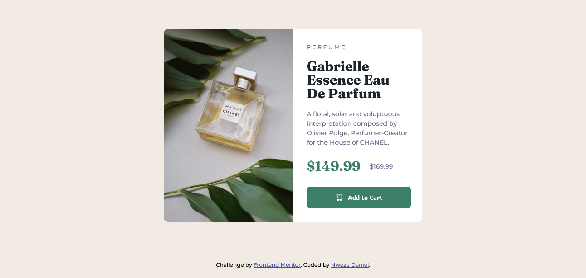

# Frontend Mentor - Product preview card component solution

This is a solution to the [Product preview card component challenge on Frontend Mentor](https://www.frontendmentor.io/challenges/product-preview-card-component-GO7UmttRfa). Frontend Mentor challenges help you improve your coding skills by building realistic projects.

## Table of contents

- [Overview](#overview)
  - [The challenge](#the-challenge)
  - [Screenshot](#screenshot)
  - [Links](#links)
- [My process](#my-process)
  - [Built with](#built-with)
  - [What I learned](#what-i-learned)
  - [Continued development](#continued-development)
  - [Useful resources](#useful-resources)
- [Author](#author)

## Overview

### The challenge

Users should be able to:

- View the optimal layout depending on their device's screen size
- See hover and focus states for interactive elements

### Screenshot



### Links

- Live Site URL: [Add live site URL here](https://your-live-site-url.com)

## My process

### Built with

- Semantic HTML5 markup
- CSS custom properties
- Flexbox
- CSS Grid
- Mobile-first workflow

### What I learned

how to make Responsive media using the picture tag.

To see how you can add code snippets, see below:

```html
<picture>
  <source media="(min-width: 40em)" srcset="images/image-product-desktop.jpg" />
  
</picture>
```

### Continued development

Next projects focus will be more on Responsive design best practies and
accessibility.

### Useful resources

- [Responsive Design](https://web.dev/learn/design) - This helped me for best design practies. I really liked the patterns and will use it going forward.

## Author

- Frontend Mentor - [@Flashdaniel](https://www.frontendmentor.io/profile/Flashdaniel)
- Linkedin - [@Nweze Daniel](https://www.linkedin.com/in/daniel-nweze-017909214/)
